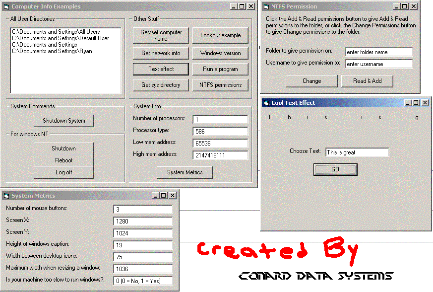



## System Information Examples

### Description

This is just a bunch of pure API code relating towards systems information. Some of it is useless and some of it is cool. I just threw it all together in one big example. See the screenshot to see what this program can do. Enjoy!
 
### More Info
 

             |
---                |---
**Submitted On**   |2003-10-12 16:48:44
**By**             |[Conard Data Systems](https://github.com/Planet-Source-Code/PSCIndex/blob/master/ByAuthor/conard-data-systems.md)
**Level**          |Intermediate
**User Rating**    |4.0 (8 globes from 2 users)
**Compatibility**  |VB 6\.0
**Category**       |[Coding Standards](https://github.com/Planet-Source-Code/PSCIndex/blob/master/ByCategory/coding-standards__1-43.md)
**World**          |[Visual Basic](https://github.com/Planet-Source-Code/PSCIndex/blob/master/ByWorld/visual-basic.md)
**Archive File**   |[System\_Inf16576010122003\.zip](https://github.com/Planet-Source-Code/conard-data-systems-system-information-examples__1-49190/archive/master.zip)

